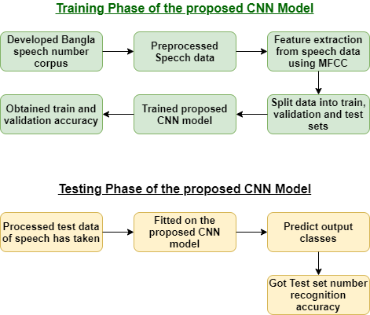

# Bangla-Spoken-Number-Recognition

## Table of content

- [Motivation](#motivation)
- [Introduction](#introduction)
- [Quick Start Guide](#quick-start-guide)
- [Methodology](#methodology)
- [Contribution](#contribution)
- [Links and References](#links-and-references)
- [Authors](#authors)
- [Licensing](#licensing)

## Motivation
Speech is a very convenient way to interact with machines. At present, most features of the electronic devices are controlled through speech signals. Bangla speech based system lags behind in this human-machine interaction field. In order to create such speech controlled based systems, we first need to teach machines to recognize Bangla speech.

## Introduction
Automatic speech recognition (ASR) converts human speech into text or words that can beunderstood and classified easily. Only digits from '০-৯' were used in the few studies on Bangla number recognition systems, which completely ignored duo-syllabic and tri-syllabic numbers. In this paper, audio samples from different genders, age groups, and dialects of Bangladeshi people were used to create a speech dataset of spoken numbers from '০-৯৯'. The raw speech data is subjected to various audio augmentation techniques such as time shift, speed tuning, background noise mixing, and volume tuning. Then, to extract meaningful features from the data, Mel Frequency Cepstrum Coefficients (MFCCs) are used. This research developed a Bangla number recognition system based on Convolutional Neural Networks (CNNs). The proposed method recognizes '০-৯৯' Bangla spoken numbers with 89.61% accuracy across the entire dataset. The model’s effectiveness was also tested using 10-fold cross-validation, with 89.74% accuracy for recognizing '০-৯৯' Bangla spoken numbers across the entire dataset.

## Quick Start Guide
1. clone this repo `https://github.com/PiasRoY/Bangla-Spoken-Number-Recognition.git`
2. collect our own developed dataset from here: `https://www.kaggle.com/piasroy/bangla-spoken-099-numbers`
3. copy all the folders labelled from "0-99" and paste them into the `Bangla_Spoken_Numbers` folder of this repo.
4. install required python dependencies from `requirements.txt`.
5. open and run `100_class_CNN.ipynb`.

## Methodology
In this study, a Bangla numerical speech recognition system has been proposed using deep learning models. Initially, a speech corpus of Bangla numbers from '০-৯৯' (0-99) was
created. The raw speech data is then preprocessed to remove noise and silence from the signals. The raw speech data were then subjected to various audio augmentation techniques. After that, the MFCC features are extracted from the speech data that has been processed. The dataset is then divided into three sets: train, validation, and test.
The train and validation data are used to train our proposed CNN model in the training phase and got the train and validation accuracy of the dataset. The processed test data is fed into the CNN model during the testing phase of the proposed CNN model to obtain the predicted output classes and the CNN model’s test accuracy for the dataset. We also used the cross- validation technique to check the effectiveness of the model’s performance. Figure below shows the Basic structure of the proposed deep learning-based model for numerical speech recognition.

## Contribution
There aren't many open source project on speech recognition systems, specially on Bangla Language. Therefore, it will be helpful for those who want to work on speech recognition and create their own unique project. Good Luck to you and give a star to this repo. 👍

## Links and References
- O. Sen, Al-Mahmud and P. Roy, "A Convolutional Neural Network Based Approach to Recognize Bangla Spoken Digits from Speech Signal," 2021 International Conference on Electronics, Communications and Information Technology (ICECIT), 2021, pp. 1-4, doi: 10.1109/ICECIT54077.2021.9641322.
- M. Shuvo, S. A. Shahriyar, and M. Akhand, “Bangla numeral recognition from speech signal using convolutional neural network,” in 2019 International Conference on Bangla Speech and Language Processing (ICBSLP). IEEE, 2019, pp. 1–4.
- R. Sharmin, S. K. Rahut, and M. R. Huq, “Bengali spoken digit classification: A deep learning approach using convolutional neural network,” Procedia Computer Science, vol. 171, pp. 1381–1388, 2020
- B. Paul, S. Bera, R. Paul, and S. Phadikar, “Bengali spoken numerals recognition by mfcc and gmm technique,” in Advances in Electronics, Communication and Computing. Springer, 2021, pp. 85–96.
- http://www.practicalcryptography.com/miscellaneous/machine-learning/guide-mel-frequency-cepstral-coefficients-mfccs

## Authors
Pias Roy, Ovishake Sen 
pias.kuet@gmail.com 
sen1607066@stud.kuet.ac.bd 
Department of Computer Science and Engineering 
Khulna University of Engineering & Technology, Khulna 
Bangladesh

## Licensing
The code in this project is licensed under MIT License.
      
